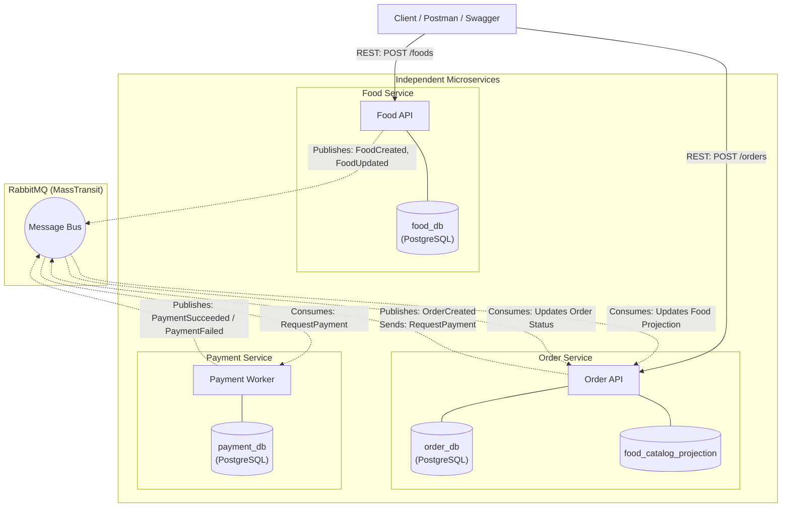
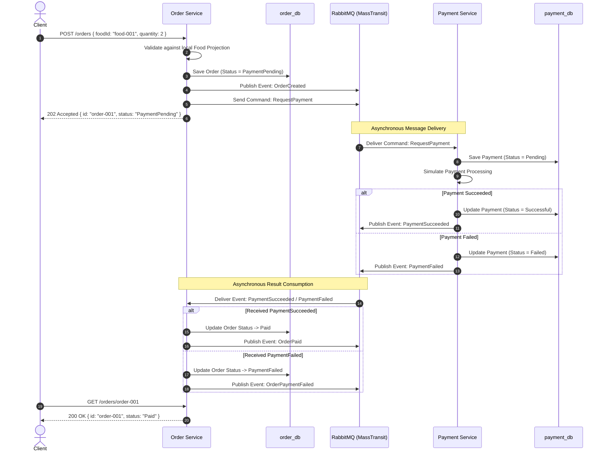

# 🍔 Food Ordering System — Microservices & Event-Driven MVP

[](#technology-stack)
[](#architecture-goals)
[](#rabbitmq-and-masstransit)
[-4169E1?logo=postgresql&logoColor=white>)](#database-design)
[](#docker-environment)

A focused, educational food ordering microservices platform designed specifically to demonstrate **Microservices Architecture**, **Database-per-Service**, **Event-Driven Architecture (EDA)**, and **Eventual Consistency** using **ASP.NET Core**, **MassTransit**, **RabbitMQ**, and **PostgreSQL**.

---

## 🎯 1. Product Overview & Core Philosophy

The primary objective of this project is:

> **Build the smallest useful system that allows us to clearly understand how independently owned microservices communicate through events and commands without sharing databases.**

This is intentionally an MVP for architectural learning rather than a bloated production clone.

### Key Principles

1. **Independent Services**: Each service has a single business boundary, can be deployed, started, or stopped independently.
2. **Database-per-Service**: `food_db`, `order_db`, and `payment_db` are isolated. No cross-service SQL joins or shared database contexts.
3. **Asynchronous Communication**: Services communicate via RabbitMQ through MassTransit.
4. **Commands vs. Events**:
   - **Commands**: Explicit instructions sent to a specific target (*"Please do this"* e.g., `RequestPayment`).
   - **Events**: Historical facts published to the system (*"This already happened"* e.g., `OrderCreated`, `PaymentSucceeded`).
5. **Eventual Consistency**: State updates propagate asynchronously across service boundaries.

---

## 👥 2. Team of 3 — Ownership & Work Division

To ensure smooth collaboration, zero git merge conflicts, and clear ownership, responsibilities are divided across the 3 engineers:

| Role                  | Primary Service                            | Core Responsibilities                                               | Key Deliverables                                                                                                                                                                                                                                       |
| :-------------------- | :----------------------------------------- | :------------------------------------------------------------------ | :----------------------------------------------------------------------------------------------------------------------------------------------------------------------------------------------------------------------------------------------------- |
| **Developer 1** | **Food Service**                     | Catalog source of truth, Food CRUD, lifecycle event publishing      | •`FoodService` API & EF Core DbContext• `FoodCreated`, `FoodUpdated`, `FoodAvailabilityChanged`, `FoodDeleted` publisher• Swagger & testing endpoints                                                                                     |
| **Developer 2** | **Order Service**                    | Order state machine, local food projection, workflow orchestration  | •`OrderService` API & EF Core DbContext• Local food projection consumer• `CreateOrder`, `RequestPayment` sender, `OrderCreated` publisher• `PaymentSucceeded`/`PaymentFailed` consumer & order status updater                          |
| **Developer 3** | **Payment Service & Infra Backbone** | Payment simulation, shared messaging foundation, Docker environment | •`PaymentService` & EF Core DbContext• `RequestPayment` consumer & `PaymentSucceeded`/`PaymentFailed` publisher• Shared `FoodOrder.Contracts` library & MassTransit bus config• `docker-compose.yml` (RabbitMQ + PostgreSQL instances) |

---

## 🏛 3. Architecture Overview

### Service Topology & Message Highway



---

## 🔄 4. Core Order & Payment Workflow

The primary business flow demonstrates asynchronous command handling and eventual consistency:



---

## 📨 5. Message Inventory & Shared Contracts

All messages reside in a shared, decoupled project: `contracts/FoodOrder.Contracts`.

### Commands (Imperative: *"Please do this"*)

| Command            | Publisher         | Target Consumer    | Purpose                                    |
| :----------------- | :---------------- | :----------------- | :----------------------------------------- |
| `CreateOrder`    | Client / Internal | `OrderService`   | Requests creation of an order              |
| `RequestPayment` | `OrderService`  | `PaymentService` | Explicitly instructs payment processing    |
| `CancelOrder`    | Client / API      | `OrderService`   | Requests order cancellation before payment |

### Events (Past Tense: *"Something happened"*)

| Event                       | Publisher          | Consumers            | Purpose                                                 |
| :-------------------------- | :----------------- | :------------------- | :------------------------------------------------------ |
| `FoodCreated`             | `FoodService`    | `OrderService`     | Announces new food item for local projection            |
| `FoodUpdated`             | `FoodService`    | `OrderService`     | Announces food detail changes                           |
| `FoodAvailabilityChanged` | `FoodService`    | `OrderService`     | Announces item availability toggle (`true`/`false`) |
| `FoodDeleted`             | `FoodService`    | `OrderService`     | Announces food item retirement                          |
| `OrderCreated`            | `OrderService`   | Observers / Logs     | Announces order creation with snapshot price            |
| `OrderPaid`               | `OrderService`   | Observers / External | Announces order successfully marked as`Paid`          |
| `OrderPaymentFailed`      | `OrderService`   | Observers / External | Announces order marked as`PaymentFailed`              |
| `OrderCancelled`          | `OrderService`   | `PaymentService`   | Announces order cancellation                            |
| `PaymentSucceeded`        | `PaymentService` | `OrderService`     | Announces successful simulated payment                  |
| `PaymentFailed`           | `PaymentService` | `OrderService`     | Announces payment failure with reason                   |
| `PaymentCancelled`        | `PaymentService` | `OrderService`     | Announces payment reversal                              |

---

## 💾 6. Database Strategy & Schemas

Each service runs its own isolated PostgreSQL database instance:

```text
PostgreSQL Server
├── food_db       (Owned by Food Service)
├── order_db      (Owned by Order Service)
└── payment_db    (Owned by Payment Service)
```

### Table Definitions

#### `food_db` (Food Service)

```sql
CREATE TABLE foods (
    id UUID PRIMARY KEY,
    name VARCHAR(100) NOT NULL,
    description TEXT,
    price DECIMAL(10, 2) NOT NULL,
    is_available BOOLEAN NOT NULL DEFAULT TRUE,
    created_at TIMESTAMP WITH TIME ZONE DEFAULT NOW(),
    updated_at TIMESTAMP WITH TIME ZONE DEFAULT NOW()
);
```

#### `order_db` (Order Service)

```sql
-- Orders table
CREATE TABLE orders (
    id UUID PRIMARY KEY,
    food_id UUID NOT NULL,
    food_name VARCHAR(100) NOT NULL,
    unit_price DECIMAL(10, 2) NOT NULL,
    quantity INT NOT NULL,
    total_price DECIMAL(10, 2) NOT NULL,
    status VARCHAR(50) NOT NULL, -- Pending, PaymentPending, Paid, PaymentFailed, Cancelled
    created_at TIMESTAMP WITH TIME ZONE DEFAULT NOW(),
    updated_at TIMESTAMP WITH TIME ZONE DEFAULT NOW()
);

-- Local Food Projection table (populated strictly from RabbitMQ events)
CREATE TABLE food_catalog_projection (
    food_id UUID PRIMARY KEY,
    name VARCHAR(100) NOT NULL,
    price DECIMAL(10, 2) NOT NULL,
    is_available BOOLEAN NOT NULL,
    last_event_id UUID,
    updated_at TIMESTAMP WITH TIME ZONE DEFAULT NOW()
);
```

#### `payment_db` (Payment Service)

```sql
CREATE TABLE payments (
    id UUID PRIMARY KEY,
    order_id UUID NOT NULL,
    amount DECIMAL(10, 2) NOT NULL,
    currency VARCHAR(10) NOT NULL DEFAULT 'USD',
    status VARCHAR(50) NOT NULL, -- Pending, Successful, Failed, Cancelled
    failure_reason TEXT,
    created_at TIMESTAMP WITH TIME ZONE DEFAULT NOW(),
    updated_at TIMESTAMP WITH TIME ZONE DEFAULT NOW()
);
```

#### Idempotency Table (In each service database)

```sql
CREATE TABLE processed_messages (
    message_id UUID NOT NULL,
    consumer_name VARCHAR(100) NOT NULL,
    processed_at TIMESTAMP WITH TIME ZONE DEFAULT NOW(),
    PRIMARY KEY (message_id, consumer_name)
);
```

---

## 📂 7. Recommended Solution Structure

```text
food_order/
├── src/
│   ├── FoodService/
│   │   ├── Controllers/          # REST endpoints (CRUD /foods)
│   │   ├── Data/                 # FoodDbContext & EF Migrations
│   │   ├── Models/               # Food entity
│   │   └── Program.cs
│   │
│   ├── OrderService/
│   │   ├── Controllers/          # REST endpoints (POST /orders, GET /orders/{id})
│   │   ├── Consumers/            # Food lifecycle consumers & Payment result consumers
│   │   ├── Data/                 # OrderDbContext (Orders + FoodCatalogProjection)
│   │   ├── Models/               # Order & FoodCatalogProjection entities
│   │   └── Program.cs
│   │
│   └── PaymentService/
│       ├── Consumers/            # RequestPaymentConsumer
│       ├── Data/                 # PaymentDbContext
│       ├── Models/               # Payment entity
│       ├── Services/             # Simulated payment processor
│       └── Program.cs
│
├── contracts/
│   └── FoodOrder.Contracts/      # Shared class library (Messages only!)
│       ├── Commands/
│       │   ├── CreateOrder.cs
│       │   ├── RequestPayment.cs
│       │   └── CancelOrder.cs
│       └── Events/
│           ├── FoodCreated.cs
│           ├── FoodUpdated.cs
│           ├── FoodAvailabilityChanged.cs
│           ├── FoodDeleted.cs
│           ├── OrderCreated.cs
│           ├── OrderPaid.cs
│           ├── OrderPaymentFailed.cs
│           ├── OrderCancelled.cs
│           ├── PaymentSucceeded.cs
│           ├── PaymentFailed.cs
│           └── PaymentCancelled.cs
│
├── docker-compose.yml            # PostgreSQL instances + RabbitMQ + Web APIs
├── docker-compose.infra.yml      # RabbitMQ & PostgreSQL only (for local debugging)
├── FoodOrder.sln                 # .NET Solution file
└── README.md
```

---

## 🛠 8. Technology Stack

| Area                            | Technology                     | Choice Rationale                                                             |
| :------------------------------ | :----------------------------- | :--------------------------------------------------------------------------- |
| **Runtime & Language**    | C# / .NET 8 or 9               | High-performance, modern type-safe backend                                   |
| **Framework**             | ASP.NET Core Web API           | Clean controllers, dependency injection, and native middleware               |
| **Message Broker**        | RabbitMQ (Management Image)    | Battle-tested, topic & exchange visualization via web dashboard              |
| **Messaging Abstraction** | MassTransit                    | Native saga, retry policies, correlation IDs, outbox, and broker abstraction |
| **Database**              | PostgreSQL                     | Robust relational database, separate databases per service                   |
| **ORM & Migrations**      | Entity Framework Core (Npgsql) | Code-first database migrations per service boundary                          |
| **Containerization**      | Docker & Docker Compose        | Frictionless local orchestration across the entire team                      |
| **API Documentation**     | Swagger / OpenAPI              | Built-in interactive testing UI per service                                  |

---

## 🚀 9. Getting Started

### Prerequisites

- [.NET SDK 8.0+](https://dotnet.microsoft.com/download)
- [Docker Desktop](https://www.docker.com/products/docker-desktop/)
- An IDE: [Visual Studio 2022](https://visualstudio.microsoft.com/) / [JetBrains Rider](https://www.jetbrains.com/rider/) / [VS Code](https://code.visualstudio.com/)

### Step 1: Start Supporting Infrastructure

Run RabbitMQ and the PostgreSQL database instances:

```bash
docker compose -f docker-compose.infra.yml up -d
```

Check running services:

- **RabbitMQ Dashboard**: `http://localhost:15672` (Username: `guest` / Password: `guest`)
- **PostgreSQL**: `localhost:5432` (Databases: `food_db`, `order_db`, `payment_db`)

### Step 2: Apply Migrations & Run Services

Open three separate terminals or run in Visual Studio (multiple startup projects):

```bash
# Terminal 1: Food Service (Port 5001)
dotnet run --project src/FoodService

# Terminal 2: Order Service (Port 5002)
dotnet run --project src/OrderService

# Terminal 3: Payment Service (Port 5003)
dotnet run --project src/PaymentService
```

### Step 3: Test the End-to-End Flow

1. **Create a Food Item**:

   ```http
   POST http://localhost:5001/api/foods
   Content-Type: application/json

   {
     "name": "Cheese Burger",
     "description": "Double patty beef burger with cheddar",
     "price": 8.50
   }
   ```

   *`FoodService` publishes `FoodCreated`. `OrderService` consumes it and stores it in its local `food_catalog_projection` table.*
2. **Place an Order**:

   ```http
   POST http://localhost:5002/api/orders
   Content-Type: application/json

   {
     "foodId": "<FOOD_ID_FROM_STEP_1>",
     "quantity": 2
   }
   ```

   *Response: Status `PaymentPending`. `OrderService` sends `RequestPayment` to RabbitMQ.*
3. **Check Payment & Eventual Consistency**:
   *`PaymentService` consumes `RequestPayment`, generates a simulated success, and publishes `PaymentSucceeded`.*
   *`OrderService` consumes `PaymentSucceeded`, marks the order as `Paid`, and publishes `OrderPaid`.*
4. **Verify Final Order Status**:

   ```http
   GET http://localhost:5002/api/orders/<ORDER_ID>
   ```

   *Response: Status is now `Paid` with total amount `$17.00`.*

---

## 🧪 10. Failure Scenarios to Test (Learning Objectives)

1. **Payment Service Offline**:
   - Stop `PaymentService`.
   - Place a new order (`POST /orders`). Order enters `PaymentPending`.
   - Start `PaymentService`. The pending `RequestPayment` message is immediately picked up from RabbitMQ, processed, and the order transitions to `Paid`.
2. **Food Service Offline**:
   - Stop `FoodService`.
   - Place a new order with existing food. Order succeeds because `OrderService` reads its local food projection without contacting `FoodService`.
3. **Simulated Payment Failure**:
   - Order with a specific flag or amount to trigger failure.
   - Verify that `PaymentFailed` is published and `OrderService` transitions status to `PaymentFailed`.
4. **Idempotency & Duplicate Delivery**:
   - Replay a duplicate `PaymentSucceeded` event.
   - Verify that `order_db` ignores the duplicate and prevents duplicate state transitions.

---

## 📈 11. Development Sprints (Phased Plan)

- [X] **Phase 1**: Architecture design, message contract definitions, project specifications.
- [ ] **Phase 2**: Infrastructure setup (`docker-compose.infra.yml`), Solution & Shared Contracts (`FoodOrder.Contracts`).
- [ ] **Phase 3**: Food Service implementation (CRUD + `FoodCreated`, `FoodUpdated`, `FoodAvailabilityChanged`).
- [ ] **Phase 4**: Order Service local projection (consuming food events).
- [ ] **Phase 5**: Order creation & `RequestPayment` command integration.
- [ ] **Phase 6**: Payment Service simulation & `PaymentSucceeded`/`PaymentFailed` publishing.
- [ ] **Phase 7**: Order status update from payment events & eventual consistency verification.
- [ ] **Phase 8**: Cancellation flow & idempotency safeguards.
- [ ] **Phase 9**: Full system `docker-compose.yml` packaging & failure scenario demonstrations.

---

## 📄 License

This project is created for educational purposes under the [MIT License](LICENSE).
